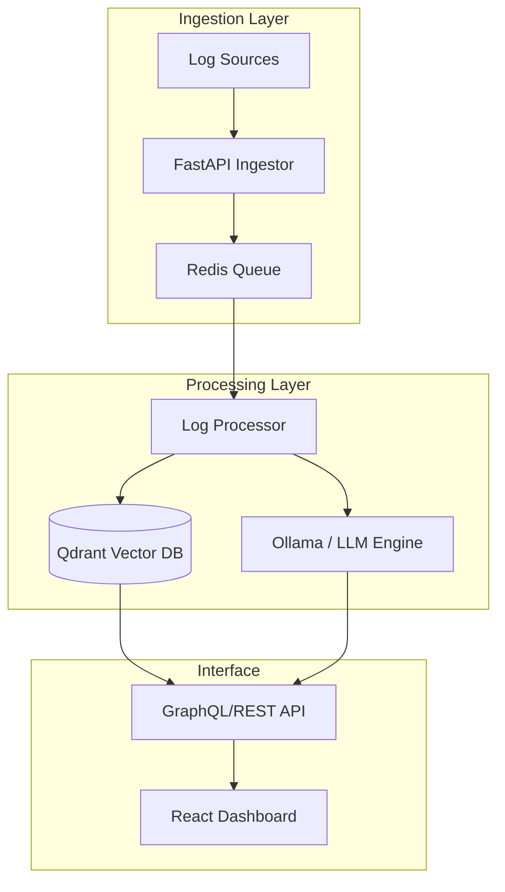

# Logara AI

Logara AI is a modular observability platform designed to transform raw, noisy log streams into actionable intelligence. By combining high-performance ingestion with vector-based semantic search and local LLM processing, it provides developers with instant insights into system behavior without the overhead of manual pattern matching.

## Core Capabilities

- **Semantic Log Search**: Transition from keyword-based Grep to natural language queries using Qdrant vector embeddings.
- **Root Cause Synthesis**: Automated analysis of error clusters to identify underlying infrastructure or application issues.
- **Local-First Processing**: Designed to run with Ollama for sensitive log data that shouldn't leave your infrastructure.
- **Anomaly Correlation**: Detects statistical outliers in log volume and type to preempt site reliability issues.

## Architecture

Logara is built as a series of decoupled microservices to ensure scalability during log spikes:



## Development Status & Roadmap

Logara AI is currently in **active development (Alpha)**. We are focusing on stabilization of the ingestion pipeline and refining the embedding strategy for nested JSON logs.

### 2026 Roadmap

- [ ] **Q2**: Implementation of OpenTelemetry (OTel) collector integration.
- [ ] **Q2**: Support for persistent vector storage partitioning by 'service_id'.
- [ ] **Q3**: Beta release of the "Explain Error" hover-state in the dashboard.
- [ ] **Q4**: Multi-tenant RBAC for enterprise-grade deployments.

## Getting Started

### Prerequisites

- Python 3.10+
- Node.js 20+
- Docker & Docker Compose (for Qdrant & Redis)

### Quick Start (Local Dev)

1. **Clone & Setup**:

   ```bash
   git clone https://github.com/Dharanish-AM/Logara-AI.git
   cd Logara-AI
   ```

Before running, set your Redis password in .env:

```bash
cp .env.example .env
# Edit .env and set REDIS_PASSWORD
```

2. **Start Infrastructure**:

   ```bash
   docker-compose up -d
   ```

3. **Backend**:

   ```bash
   cd backend
   python -m venv venv
   source venv/bin/activate
   pip install -r requirements.txt
   
   # In terminal 1: Start the ingestor API
   fastapi dev main.py
   
   # In terminal 2: Start the background log processor
   python worker.py
   ```

4. **Frontend**:

   ```bash
   cd frontend
   npm install
   npm run dev
   ```

## Contributing

We welcome contributions that focus on performance optimizations in the log processing pipeline. Please see [CONTRIBUTING.md](./CONTRIBUTING.md) for our technical standards.

## License

MIT License.
