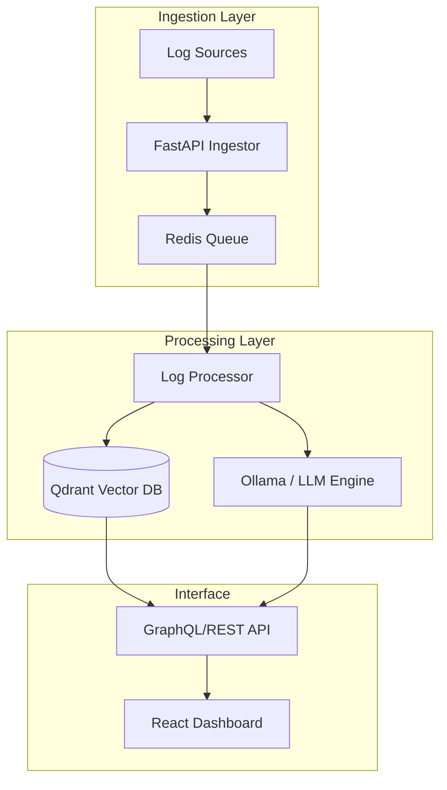

# Logara AI

Logara AI is a modular observability platform designed to transform raw, noisy log streams into actionable intelligence. By combining high-performance ingestion with vector-based semantic search and local LLM processing, it provides developers with instant insights into system behavior without the overhead of manual pattern matching.

## Core Capabilities

- **Semantic Log Search**: Transition from keyword-based Grep to natural language queries using Qdrant vector embeddings.
- **Root Cause Synthesis**: Automated analysis of error clusters to identify underlying infrastructure or application issues.
- **Local-First Processing**: Designed to run with Ollama for sensitive log data that shouldn't leave your infrastructure.
- **Anomaly Correlation**: Detects statistical outliers in log volume and type to preempt site reliability issues.
- **Security-Aware Log Sanitization**: Automatically redacts sensitive data such as API keys, JWTs, emails, bearer tokens, and credit card patterns before logs enter downstream processing pipelines.

## Architecture

Logara is built as a series of decoupled microservices to ensure scalability during log spikes:



## Development Status & Roadmap

Logara AI is currently in **active development (Alpha)**. We are focusing on stabilization of the ingestion pipeline and refining the embedding strategy for nested JSON logs.

## Security & Redaction Pipeline

Logara AI includes a configurable backend redaction pipeline designed to sanitize sensitive information before logs enter queue processing, vectorization, or downstream AI workflows.

### Currently Supported Redaction Types

- JWT tokens
- API keys
- AWS access keys
- Bearer tokens
- Email addresses
- Credit card patterns (Luhn validated)
- Optional IPv4 masking

### Redaction Observability

The backend ingestion pipeline also supports:

- lightweight redaction metrics tracking
- structured redaction summaries
- nested payload sanitization
- recursive dictionary/list redaction handling

This helps improve operational visibility while reducing the risk of sensitive data exposure during observability workflows.

### 2026 Roadmap

- [x] **Q2**: Implementation of OpenTelemetry (OTel) collector integration.
- [ ] **Q2**: Support for persistent vector storage partitioning by 'service_id'.
- [ ] **Q3**: Beta release of the "Explain Error" hover-state in the dashboard.
- [ ] **Q4**: Multi-tenant RBAC for enterprise-grade deployments.

## Ingestion API Endpoints

Logara AI provides two main ingestion endpoints:

1. **Standard Ingest (`POST /ingest`)**:
   - For single, raw log strings.
   - Body format: `{"log_data": "[2026-05-16 10:30:00] INFO: service started"}`

2. **OpenTelemetry Log Ingest (`POST /v1/logs`)**:
   - For standard OpenTelemetry (OTLP) log collector HTTP exports.
   - Accepts standard JSON batches of resource logs, scope logs, and log records.
   - Automatically merges resource attributes, extracts timestamps/severity levels, and preserves metadata.

## Getting Started

### Prerequisites

- Python 3.10+
- Node.js 20+
- Docker & Docker Compose (for Qdrant & Redis)

### Quick Start (Local Dev)

1. **Clone & Setup**:

   ```bash
   git clone https://github.com/Dharanish-AM/Logara-AI.git
   cd Logara-AI
   ```

Before running, set your Redis password in .env:

```bash
cp .env.example .env
# Edit .env and set REDIS_PASSWORD
```

2. **Start Infrastructure**:

   ```bash
   docker-compose up -d
   ```

3. **Backend**:

   ```bash
   cd backend
   python -m venv venv
   source venv/bin/activate
   pip install -r requirements.txt

   # In terminal 1: Start the ingestor API
   fastapi dev main.py

   # In terminal 2: Start the background log processor
   python worker.py
   ```

4. **Frontend**:

   ```bash
   cd frontend
   npm install
   npm run dev
   ```

## CI/CD Validation

The repository now includes GitHub Actions validation for pull requests and deploy-readiness checks for the main branch.

- `CI` runs on pull requests and manual dispatch.
- `Pre-Deploy Validation` runs on pushes to `main` and manual dispatch.
- Shared logic lives in `.github/workflows/repo-validation.yml` so CI and pre-deploy stay aligned.

Current validation covers:

- backend dependency install, import compilation, and `pytest`
- frontend dependency install, `eslint`, and production build
- repository deploy prerequisite checks via `.github/scripts/validate_deploy.py`
- Docker Compose configuration validation with `docker compose config`
- backend smoke checks that import the FastAPI app and worker successfully

## Contributing

We welcome contributions that focus on performance optimizations in the log processing pipeline. Please see [CONTRIBUTING.md](./CONTRIBUTING.md) for our technical standards.

## Contributors ✨

Thanks goes to these wonderful people for contributing to this project ❤️

<a href="https://github.com/Dharanish-AM/Logara-AI/graphs/contributors">
  
</a>

## License

MIT License.
