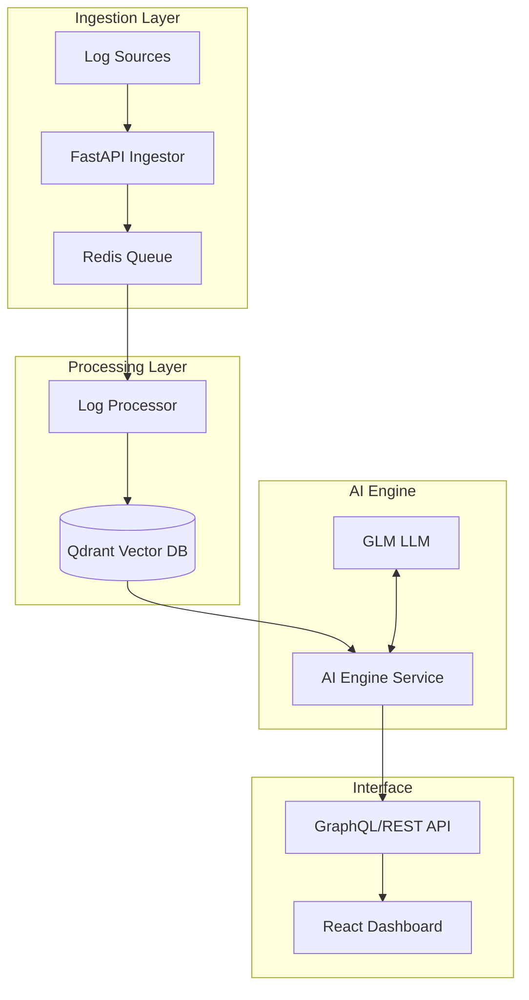
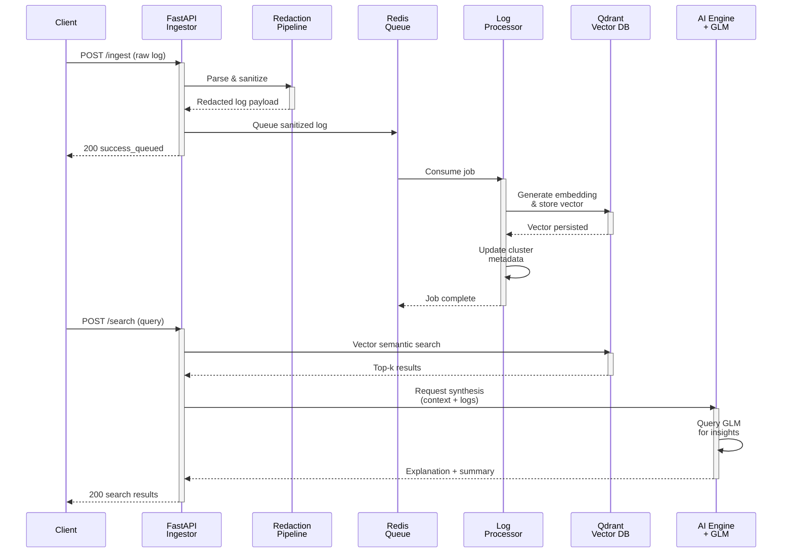

#Logara AI

Logara AI is a modular observability platform designed to transform raw, noisy log streams into actionable intelligence. By combining high-performance ingestion with vector-based semantic search and local LLM processing, it provides developers with instant insights into system behavior without the overhead of manual pattern matching.

## Table of Contents

- [Core Capabilities](#core-capabilities)
- [Architecture](#architecture)
- [Development Status & Roadmap](#development-status--roadmap)
- [Security & Redaction Pipeline](#security--redaction-pipeline)
  - [Currently Supported Redaction Types](#currently-supported-redaction-types)
  - [Redaction Observability](#redaction-observability)
  - [Semantic Duplicate Clustering](#semantic-duplicate-clustering)
    - [Configurable Settings](#configurable-settings)
    - [Example Behavior](#example-behavior)
    - [Example Cluster Payloads](#example-cluster-payloads)

## Core Capabilities

- **Semantic Log Search**: Transition from keyword-based Grep to natural language queries using Qdrant vector embeddings.
- **Root Cause Synthesis**: Automated analysis of error clusters to identify underlying infrastructure or application issues.
- **LLM-Powered Analysis**: Uses GLM (via OpenAI-compatible API) for root-cause analysis and natural language insights.
- **Anomaly Correlation**: Detects statistical outliers in log volume and type to preempt site reliability issues.
- **Security-Aware Log Sanitization**: Automatically redacts sensitive data such as API keys, JWTs, emails, bearer tokens, and credit card patterns before logs enter downstream processing pipelines.

## Architecture

Logara is built as a series of decoupled microservices to ensure scalability during log spikes:



## Log Entry Lifecycle

To understand how a single log entry flows through Logara, follow this sequence diagram:



**Key Stages:**

1. **Ingestion**: Client sends a log to the FastAPI ingestor endpoint
2. **Redaction**: Sensitive data (API keys, emails, tokens) is stripped before queuing
3. **Queueing**: Sanitized log is added to Redis for asynchronous processing
4. **Processing**: Background worker consumes the job, generates embeddings, and stores vectors
5. **Duplicate Clustering**: Similar logs are grouped by semantic similarity for noise reduction
6. **Search**: When a user queries logs, semantic search retrieves relevant vectors from Qdrant
7. **AI Synthesis**: GLM LLM synthesizes findings into actionable insights
8. **Results**: Dashboard receives structured explanation and original log samples

This architecture ensures that sensitive data never reaches downstream services while enabling fast semantic search and intelligent analysis.

## Development Status & Roadmap

Logara AI is currently in **active development (Alpha)**. We are focusing on stabilization of the ingestion pipeline and refining the embedding strategy for nested JSON logs.

## Security & Redaction Pipeline

Logara AI includes a configurable backend redaction pipeline designed to sanitize sensitive information before logs enter queue processing, vectorization, or downstream AI workflows.

### Currently Supported Redaction Types

- JWT tokens
- API keys
- AWS access keys
- Bearer tokens
- Email addresses
- Credit card patterns (Luhn validated)
- Optional IPv4 masking

### Redaction Observability

The backend ingestion pipeline also supports:

- lightweight redaction metrics tracking
- structured redaction summaries
- nested payload sanitization
- recursive dictionary/list redaction handling

This helps improve operational visibility while reducing the risk of sensitive data exposure during observability workflows.

### Semantic Duplicate Clustering

The backend now supports semantic duplicate detection and clustering in the async worker pipeline.

- Embeddings are generated from a normalized semantic text representation.
- The worker searches the `log_clusters` collection for the nearest semantic match.
- Logs above the configured similarity threshold are attached to an existing cluster.
- New logs create a fresh cluster and are persisted as a raw vector point for downstream search.

#### Configurable settings

- `DUPLICATE_SIMILARITY_THRESHOLD` (default: `0.92`)
- `MAX_CLUSTER_SAMPLE_SIZE` (default: `5`)
- `ENABLE_DUPLICATE_CLUSTERING` (default: `true`)
- `QDRANT_CLUSTER_COLLECTION` (default: `log_clusters`)

#### Example behavior

Input logs:

- `ERROR: Database timeout for user 123`
- `ERROR: Database timeout for user 456`
- `ERROR: Database timeout for user 789`

These are normalized into the same semantic cluster, and the cluster metadata is updated with a higher `occurrence_count` and refreshed `last_seen` timestamp.

#### Example cluster payloads

The worker persists cluster metadata in the `log_clusters` collection, and the dashboard-ready payload shape is:

```json
{
  "cluster_id": "cluster-123",
  "representative_log": "ERROR: Database timeout for user 123",
  "occurrence_count": 3,
  "first_seen": "2026-05-22T10:00:00Z",
  "last_seen": "2026-05-22T10:02:00Z",
  "sample_logs": [
    "ERROR: Database timeout for user 123",
    "ERROR: Database timeout for user 456",
    "ERROR: Database timeout for user 789"
  ],
  "similarity_score_average": 0.95,
  "service_name": "payments-service",
  "cluster_summary": "Error cluster: database timeout",
  "duplicate_reduction_percentage": 20.0,
  "visualization_metadata": {
    "status": "duplicate",
    "severity": "error",
    "service_name": "payments-service",
    "occurrence_count": 3,
    "cluster_label": "error-database-timeout",
    "sample_count": 3
  },
  "cluster_label": "error-database-timeout",
  "is_cluster": true
}
```

The worker also produces a lightweight decision payload during ingestion:

```json
{
  "cluster_id": "cluster-123",
  "is_duplicate": true,
  "similarity_score": 0.95,
  "occurrence_count": 3,
  "representative_log": "ERROR: Database timeout for user 123",
  "first_seen": "2026-05-22T10:00:00Z",
  "last_seen": "2026-05-22T10:02:00Z",
  "sample_logs": [
    "ERROR: Database timeout for user 123",
    "ERROR: Database timeout for user 456",
    "ERROR: Database timeout for user 789"
  ]
}
```

#### Qdrant collection strategy

The clustering pipeline uses two Qdrant collections:

- `logs`: stores the raw log vectors for downstream semantic search.
- `log_clusters`: stores cluster vectors and metadata for nearest-neighbor duplicate grouping.

Recommended defaults:

- `QDRANT_CLUSTER_COLLECTION=log_clusters`
- `DUPLICATE_SIMILARITY_THRESHOLD=0.92`
- `MAX_CLUSTER_SAMPLE_SIZE=5`

Operational guidance:

- Keep `logs` as the high-volume searchable collection for raw log events.
- Keep `log_clusters` as the lower-volume semantic aggregation collection.
- Use the same embedding model for both collections so cosine search stays comparable.
- If you increase `MAX_CLUSTER_SAMPLE_SIZE`, expect slightly larger payloads in `log_clusters`.

#### Performance and tuning notes

- The duplicate-clustering path is intentionally lightweight: it performs a single nearest-neighbor search before deciding whether to upsert a new cluster.
- Set `ENABLE_DUPLICATE_CLUSTERING=false` during cold-starts or when you want to disable semantic aggregation while keeping raw log ingestion intact.
- Lower `DUPLICATE_SIMILARITY_THRESHOLD` to make clustering more aggressive; raise it to be stricter and reduce false merges.
- The duplicate reduction percentage is computed as `((occurrence_count - 1) / total_logs) * 100`, capped at `100.0`.

### 2026 Roadmap

- [x] **Q2**: Implementation of OpenTelemetry (OTel) collector integration.
- [x] **Q2**: Support for persistent vector storage partitioning by 'service_id'.
- [ ] **Q3**: Beta release of the "Explain Error" hover-state in the dashboard.
- [ ] **Q4**: Multi-tenant RBAC for enterprise-grade deployments.

## Ingestion API Endpoints

Logara AI provides two main ingestion endpoints:

1. **Standard Ingest (`POST /ingest`)**:
   - For single, raw log strings.
   - Body format: `{"log_data": "[2026-05-16 10:30:00] INFO: service started"}`

2. **OpenTelemetry Log Ingest (`POST /v1/logs`)**:
   - For standard OpenTelemetry (OTLP) log collector HTTP exports.
   - Accepts standard JSON batches of resource logs, scope logs, and log records.
   - Automatically merges resource attributes, extracts timestamps/severity levels, and preserves metadata.

### `POST /ingest` examples

#### Raw log input

```bash
curl -X POST http://localhost:8000/ingest \
  -H "Content-Type: application/json" \
  -d '{"log_data": "ERROR: Database timeout for user 123"}'
```

Example response:

```json
{
  "status": "success_queued",
  "parsed": {
    "timestamp": null,
    "level": "ERROR",
    "service": null,
    "host": null,
    "message": "ERROR: Database timeout for user 123",
    "source": null,
    "metadata": {},
    "parser_type": "structured_input",
    "raw": "ERROR: Database timeout for user 123"
  },
  "structured_output": {
    "Problem Summary": "Detected issue in logs: ERROR: Database timeout for user 123",
    "Possible Cause": "System error, timeout, invalid request, or service failure.",
    "Affected Component": "Backend ingestion pipeline / API / service layer",
    "Suggested Fix": "Check logs, validate input, monitor service health, and retry request."
  },
  "metadata": {},
  "redaction_summary": {}
}
```

#### Structured log input

```bash
curl -X POST http://localhost:8000/ingest \
  -H "Content-Type: application/json" \
  -d '{
    "timestamp": "2026-05-26T10:00:00Z",
    "level": "ERROR",
    "service": "payments-service",
    "message": "Database timeout for user 123",
    "source": "api",
    "metadata": {
      "request_id": "req-123"
    }
  }'
```

Example response:

```json
{
  "status": "success_queued",
  "parsed": {
    "timestamp": "2026-05-26T10:00:00Z",
    "level": "ERROR",
    "service": "payments-service",
    "host": null,
    "message": "Database timeout for user 123",
    "source": "api",
    "metadata": {
      "request_id": "req-123"
    },
    "parser_type": "structured_input",
    "raw": "{\"timestamp\":\"2026-05-26T10:00:00Z\",\"level\":\"ERROR\",\"service\":\"payments-service\",\"message\":\"Database timeout for user 123\",\"source\":\"api\",\"metadata\":{\"request_id\":\"req-123\"}}"
  },
  "structured_output": {
    "Problem Summary": "Detected issue in logs: Database timeout for user 123",
    "Possible Cause": "System error, timeout, invalid request, or service failure.",
    "Affected Component": "Backend ingestion pipeline / API / service layer",
    "Suggested Fix": "Check logs, validate input, monitor service health, and retry request."
  },
  "metadata": {
    "request_id": "req-123"
  },
  "redaction_summary": {}
}
```

### `POST /v1/logs` examples

#### OTel log batch

```bash
curl -X POST http://localhost:8000/v1/logs \
  -H "Content-Type: application/json" \
  -d '{
    "resourceLogs": [
      {
        "scopeLogs": [
          {
            "logRecords": [
              {
                "timeUnixNano": 1762350000000000000,
                "severityNumber": 17,
                "severityText": "ERROR",
                "body": {"stringValue": "Cache miss spike detected"},
                "attributes": {
                  "service.name": "cache-service"
                }
              }
            ]
          }
        ]
      }
    ]
  }'
```

Example response:

```json
{
  "status": "success",
  "message": "OTel logs processed successfully",
  "processed_records": 1,
  "redaction_summary": {},
  "fallback_used": false
}
```

#### Notes

- `POST /ingest` accepts either a raw `log_data` string or a structured JSON object.
- `POST /v1/logs` accepts OpenTelemetry HTTP export payloads and normalizes them before queueing.
- The worker processes queued payloads asynchronously and applies semantic duplicate clustering when enabled.
### Quick Start (Local Dev)

1. **Clone & Setup**:

   ```bash
   git clone https://github.com/Dharanish-AM/Logara-AI.git
   cd Logara-AI
   ```

Before running, set your Redis password in .env:

```bash
cp .env.example .env
# Edit .env and set REDIS_PASSWORD
```

2. **Start Infrastructure**:

   ```bash
   docker-compose up -d
   ```

3. **Backend**:

   ```bash
   cd backend
   python -m venv venv
   source venv/bin/activate
   pip install -r requirements.txt

   # In terminal 1: Start the ingestor API
   fastapi dev main.py

   # In terminal 2: Start the background log processor
   python worker.py
   ```

4. **AI Engine Service**:

   ```bash
   cd ai-engine
   python -m venv venv
   source venv/bin/activate
   pip install -r requirements.txt

   # Start the AI Engine on port 8001
   uvicorn main:app --port 8001
   ```

5. **Frontend**:

   ```bash
   cd frontend
   npm install
   npm run dev
   ```

## CI/CD Validation

The repository now includes GitHub Actions validation for pull requests and deploy-readiness checks for the main branch.

- `CI` runs on pull requests and manual dispatch.
- `Pre-Deploy Validation` runs on pushes to `main` and manual dispatch.
- Shared logic lives in `.github/workflows/repo-validation.yml` so CI and pre-deploy stay aligned.

Current validation covers:

- backend dependency install, import compilation, and `pytest`
- frontend dependency install, `eslint`, and production build
- repository deploy prerequisite checks via `.github/scripts/validate_deploy.py`
- Docker Compose configuration validation with `docker compose config`
- backend smoke checks that import the FastAPI app and worker successfully
- changed-files-aware PR CI to avoid unnecessary jobs on smaller pull requests
- backend coverage artifact generation in CI
- Docker image build validation for backend and frontend images
- live Redis/Qdrant integration smoke testing in CI
- PR title lint, commit message lint, label automation, and auto-assignment workflows

Repository governance also includes:

- structured GitHub issue forms and an issue chooser
- `CODEOWNERS` for automatic reviewer routing
- Dependabot updates for GitHub Actions, backend Python packages, and frontend npm packages
- a security audit workflow for GitHub Actions, Python dependencies, and production npm dependencies
- a branch-protection setup guide in `.github/branch-protection.md`

## Contributing

We welcome contributions that focus on performance optimizations in the log processing pipeline. Please see [CONTRIBUTING.md](./CONTRIBUTING.md) for our technical standards.

## Contributors ✨

Thanks goes to these wonderful people for contributing to this project ❤️

<a href="https://github.com/Dharanish-AM/Logara-AI/graphs/contributors">
  
</a>

## License

MIT License.
