# Logara AI 业务逻辑文档

> 本文档系统梳理 Logara AI 的业务目标、核心流程、数据模型与 API 职责，便于产品、开发与运维快速理解系统行为。
>
> 相关文档：[架构深度解析](./architecture_deep_dive.md) · [服务级向量搜索](./service-scoped-vector-search.md) · [README](../README.md)

---

## 1. 产品定位

**Logara AI** 是一个面向可观测性（Observability）的日志智能平台，核心目标是将原始、嘈杂的日志流转化为**可检索、可理解、可行动**的洞察。

| 维度 | 说明 |
|------|------|
| **领域** | 分布式系统日志采集、语义检索、根因分析、异常关联 |
| **当前阶段** | Alpha（采集管道与 embedding 策略仍在迭代） |
| **核心价值** | 从 keyword grep 转向自然语言语义搜索；结合向量库 + GLM LLM 做 RAG 分析 |
| **安全原则** | 日志在进入队列、向量化、AI 分析前必须先脱敏 |

### 1.1 四大业务能力

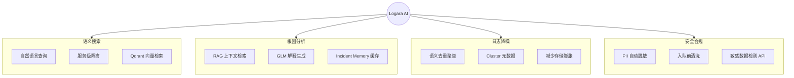

---

## 2. 系统架构总览

Logara 采用**微服务 + 异步队列**架构，将高吞吐写入与计算密集的向量化/AI 推理解耦。


### 2.1 组件职责一览

| 组件 | 端口/进程 | 核心职责 |
|------|-----------|----------|
| **Backend** | `:8000` | HTTP 接入、脱敏、解析、入队、健康检查、告警/解析/安全扩展 API |
| **Worker** | 独立进程 `python worker.py` | 消费 Redis 队列、生成 embedding、语义聚类、写入 Qdrant |
| **AI Engine** | `:8001` | 语义搜索、RAG 根因解释、Incident Memory 缓存 |
| **Frontend** | Vite dev / nginx | Dashboard 统计、LogExplorer 日志浏览 |
| **Redis** | `:6379` | 异步队列 `log_queue`，LRU 512MB |
| **Qdrant** | `:6333` | 三集合向量存储与 metadata 过滤 |

---

## 3. 核心业务流

### 3.1 日志采集（Ingestion）

采集是系统的**唯一写入入口**，支持多种 payload 格式，统一标准化后入队。

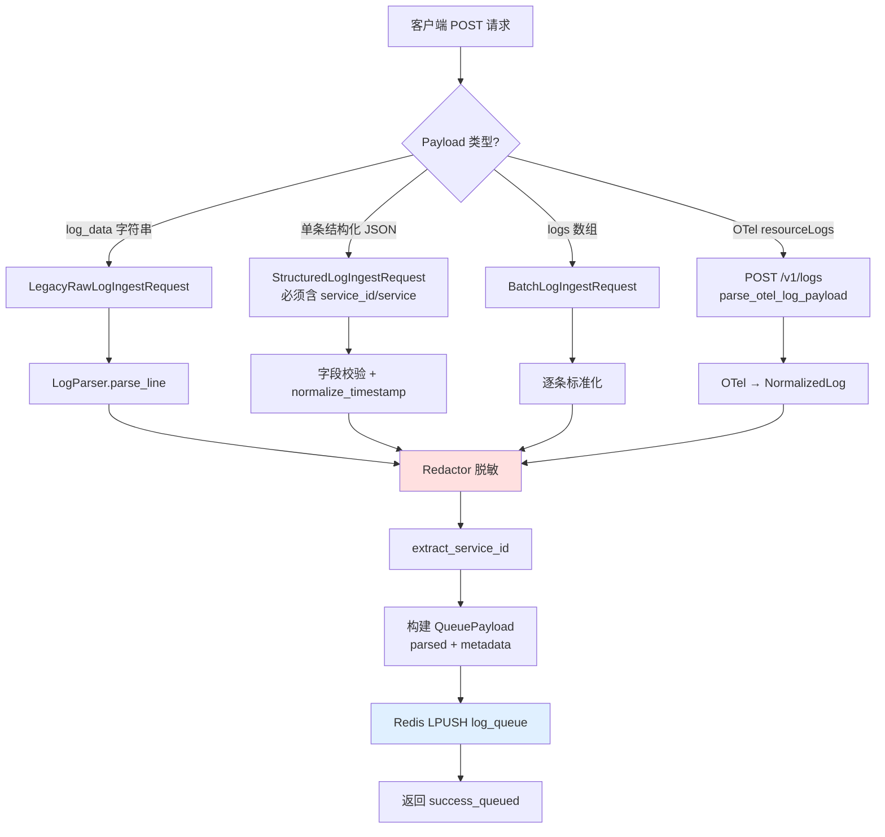

**关键代码路径：**

- 路由：`backend/routes/ingestion.py` → `ingest_logs()` / `ingest_otel_logs()`
- 服务：`backend/services/ingestion.py` → `IngestionService`
- Schema：`backend/schemas/ingestion.py` → `NormalizedLog`, `QueuePayload`

**支持的接入格式：**

| 格式 | 示例字段 | 说明 |
|------|----------|------|
| 原始文本 | `{ "log_data": "2024-01-01 ERROR ..." }` | 自动解析时间戳、级别、消息 |
| 结构化 | `{ "service_id": "payments-api", "level": "ERROR", "message": "..." }` | 推荐方式，便于服务隔离 |
| 批量 | `{ "logs": [ {...}, {...} ] }` | 多条结构化日志 |
| OTel | `{ "resourceLogs": [...] }` | OpenTelemetry HTTP 批量协议 |

**同步响应说明：** 接入 API 立即返回 `success_queued`，**不会等待**向量化完成。`format_ai_response()` 返回的是规则模板（非真实 LLM 调用）。

---

### 3.2 异步索引（Worker Processing）

Worker 从 Redis 阻塞消费，完成 embedding 生成、语义去重聚类、Qdrant 持久化。

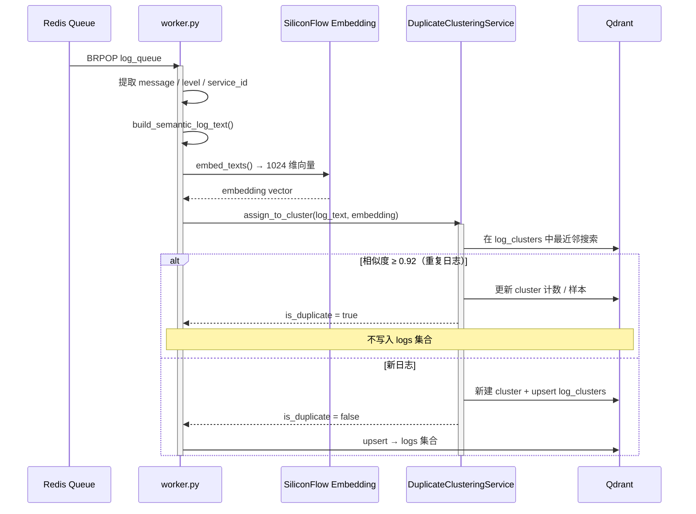

**Qdrant 三集合策略：**

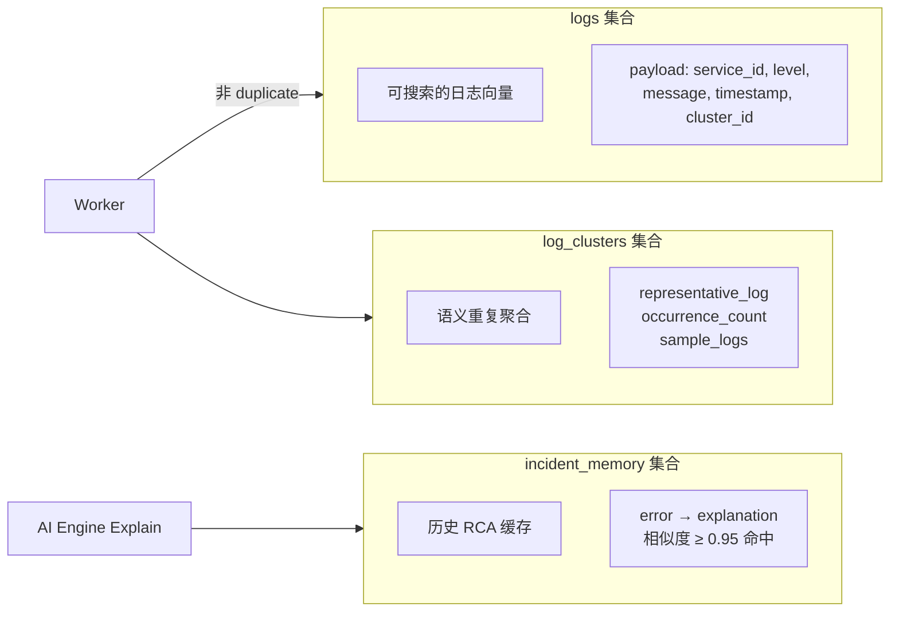

**service_id 解析优先级**（Worker `_extract_service_id()`）：

1. `service`
2. `service.name`
3. `service_id`
4. 兜底 → `"unknown_service"`

---

### 3.3 语义搜索（Search）

系统存在**三套搜索路径**，HTTP 方法不同，职责有区分：

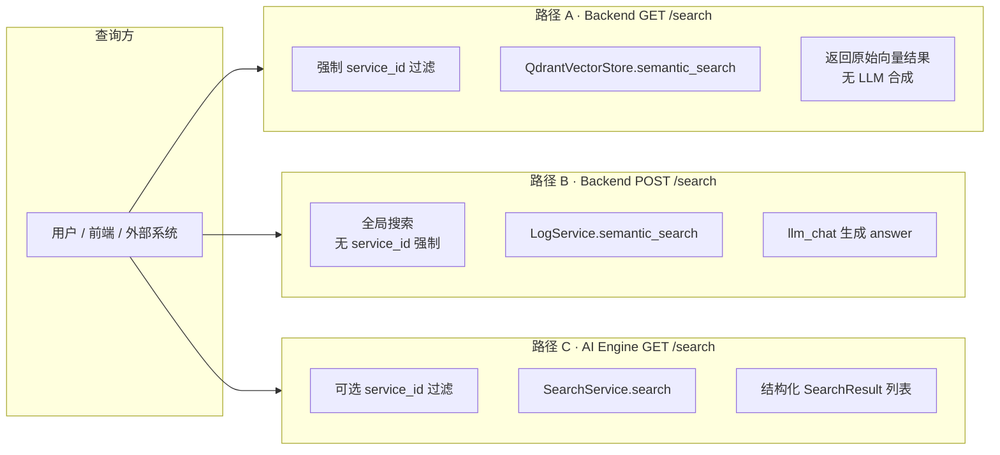

| 路径 | 端点 | 服务级隔离 | LLM 合成 | 典型场景 |
|------|------|------------|----------|----------|
| A | `GET /search?query=...&service_id=...` | ✅ 强制 | ❌ | 微服务内精准语义检索 |
| B | `POST /search` body `{ query }` | ❌ | ✅ | 跨服务探索 + 自然语言回答 |
| C | AI Engine `GET /search` | ⚪ 可选 | ❌ | 独立 AI 微服务调用 |

**服务级搜索示例**（详见 [service-scoped-vector-search.md](./service-scoped-vector-search.md)）：

```
GET /search?query=database timeout&service_id=payments-api&environment=production&severity=ERROR
```

---

### 3.4 根因解释（Explain / RAG）

AI Engine 的 Explain 是完整的 **RAG（检索增强生成）** 流水线：

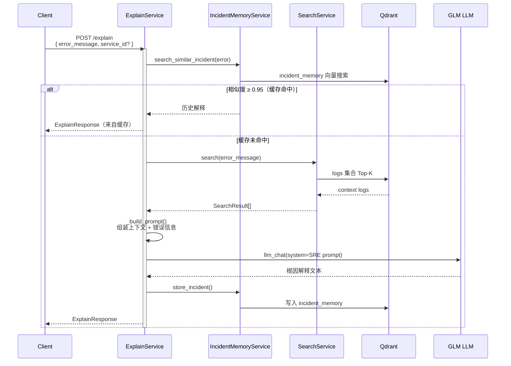

**GLM 输出结构（SRE 视角）：**

1. 错误含义的简明解释
2. 基于上下文日志的推测根因
3. 可操作的修复建议

---

### 3.5 安全脱敏（Redaction）

脱敏在**入队之前**完成，确保敏感数据不进入 Redis、Qdrant 或 LLM。

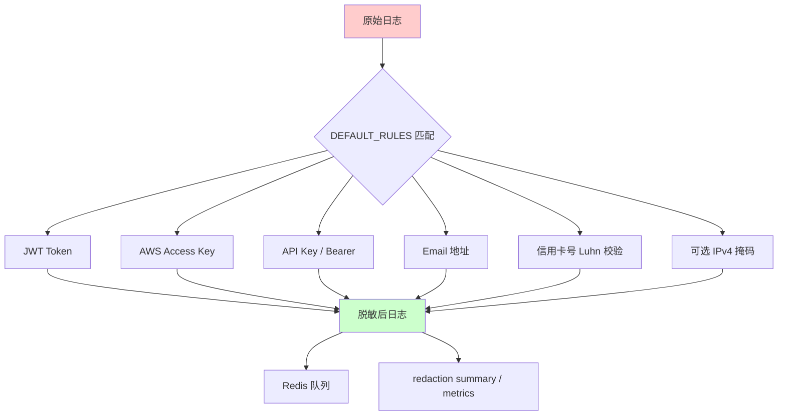

**配置项**（`backend/core/settings.py`）：

- `redact_enabled` — 是否启用（默认 true）
- `redact_patterns` — 规则列表（jwt, api_key, email 等）
- `redact_ipv4` — 是否掩码 IPv4

---

### 3.6 异常检测与告警（部分实现）

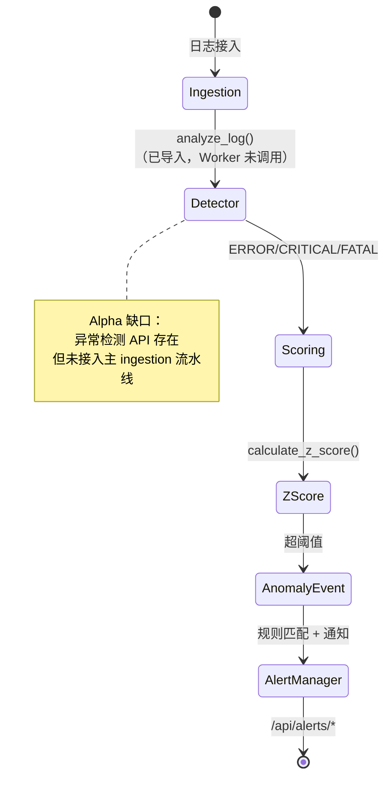

---

## 4. 数据模型

### 4.1 实体关系

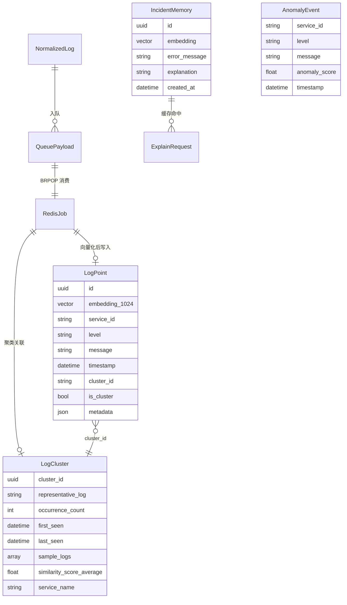

### 4.2 NormalizedLog 标准字段

| 字段 | 类型 | 说明 |
|------|------|------|
| `timestamp` | ISO 8601 | 标准化时间戳 |
| `level` | enum | INFO / WARN / ERROR / DEBUG / CRITICAL / FATAL |
| `service_id` | string | 服务标识（搜索隔离键） |
| `service` | string | 服务名（兼容旧字段） |
| `host` | string | 主机名 |
| `message` | string | 日志正文（已脱敏） |
| `source` | string | 来源标识 |
| `metadata` | object | 扩展元数据 |
| `parser_type` | string | 解析器类型 |
| `raw` | string | 原始文本（可选） |

---

## 5. API 端点地图

### 5.1 Backend 核心 API（`:8000`）

```mermaid
graph TB
    subgraph Ingest["采集"]
        I1[POST /ingest]
        I2[POST /v1/logs OTel]
    end

    subgraph Search["检索"]
        S1[GET /search<br/>服务级语义搜索]
        S2[POST /search<br/>全局搜索 + LLM]
        S3[GET /logs<br/>分页检索]
    end

    subgraph Ops["运维"]
        O1[GET /health]
        O2[GET /dashboard]
        O3[GET /metrics/parser]
        O4[GET /api/ai/status]
    end

    subgraph Ext["扩展模块"]
        E1[/api/parsing/*]
        E2[/api/alerts/*]
        E3[/api/performance/*]
        E4[/api/security/*]
    end
```

| 方法 | 路径 | 处理函数 | 业务用途 |
|------|------|----------|----------|
| POST | `/ingest` | `ingest_logs()` | 原始/结构化/批量日志接入 |
| POST | `/v1/logs` | `ingest_otel_logs()` | OTel HTTP 批量日志 |
| GET | `/search` | `semantic_search()` | **服务级**语义搜索（需 `service_id`） |
| POST | `/search` | `semantic_search()` | 全局语义搜索 + LLM 回答 |
| GET | `/logs` | `get_logs()` | Qdrant 分页日志检索 |
| GET | `/health` | `health_check()` | Redis / Qdrant / LLM 健康 |
| GET | `/dashboard` | `dashboard()` | 内存统计（遗留实现） |

### 5.2 AI Engine API（`:8001`）

| 方法 | 路径 | 服务 | 业务用途 |
|------|------|------|----------|
| GET | `/search` | `SearchService` | 语义日志搜索 |
| POST | `/explain` | `ExplainService` | RAG 根因分析 |
| GET | `/health` | — | Qdrant + LLM 可达性 |

### 5.3 Frontend 页面

| 路由 | 组件 | 调用的 Backend API |
|------|------|-------------------|
| `/` | Home + LogExplorer | `GET /logs` |
| `/dashboard` | Dashboard | `GET /dashboard` |
| `/docs` | Docs | 静态文档页 |

> **注意：** 前端当前未直接集成 AI Engine 的 `/explain` 端点。

---

## 6. 部署拓扑

### 6.1 Docker Compose 服务关系

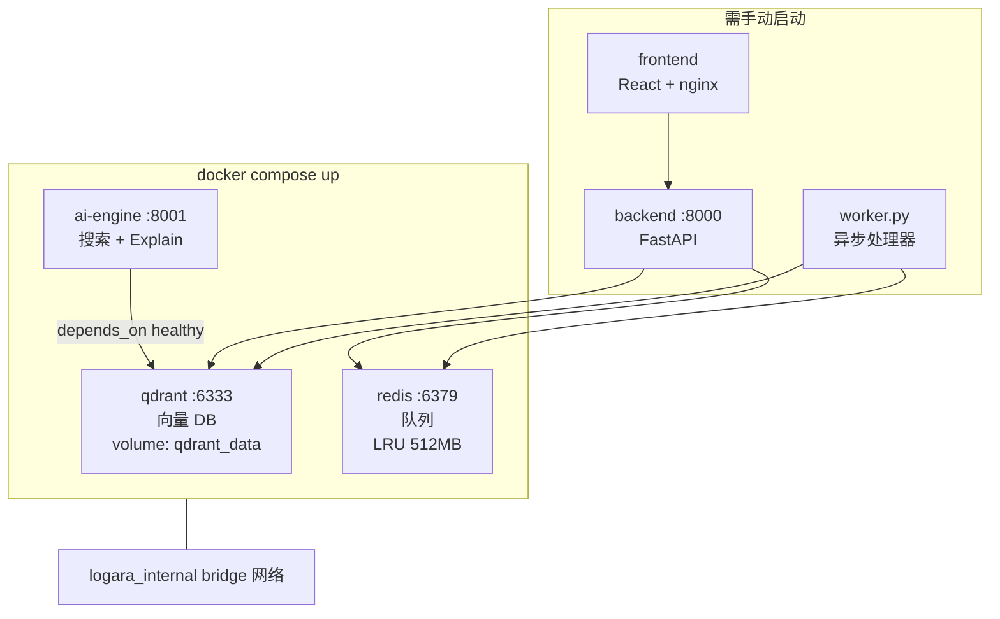

| 服务 | Compose 包含 | 说明 |
|------|-------------|------|
| qdrant | ✅ | 持久化向量存储 |
| redis | ✅ | 需配置 `REDIS_PASSWORD` |
| ai-engine | ✅ | 依赖 Qdrant healthy |
| backend | ❌ | 本地 `uvicorn main:app` 或单独构建 |
| worker | ❌ | 独立进程，与 backend 共享代码 |
| frontend | ❌ | Vite dev 或 nginx 容器 |

### 6.2 外部依赖

| 服务 | 用途 | 默认配置 |
|------|------|----------|
| **SiliconFlow** | Embedding API | `BAAI/bge-m3`, 1024 维 |
| **GLM** | LLM 对话 | OpenAI 兼容 API，`glm-5.1` |

---

## 7. 关键配置项

| 环境变量 | 默认值 | 业务影响 |
|----------|--------|----------|
| `redis_queue_name` | `log_queue` | Worker 消费队列名 |
| `qdrant_collection` | `logs` | 主搜索集合 |
| `qdrant_cluster_collection` | `log_clusters` | 去重聚类集合 |
| `duplicate_similarity_threshold` | `0.92` | 判定重复日志的相似度阈值 |
| `max_cluster_sample_size` | `5` | 每个 cluster 保留的样本数 |
| `enable_duplicate_clustering` | `true` | 是否启用语义聚类 |
| `embedding_dimensions` | `1024` | 须与 Qdrant 集合维度一致 |
| `incident_similarity_threshold` | `0.95` | RCA 缓存命中阈值 |
| `redact_enabled` | `true` | 脱敏开关 |

---

## 8. 端到端业务场景示例

### 场景 A：支付服务超时排查

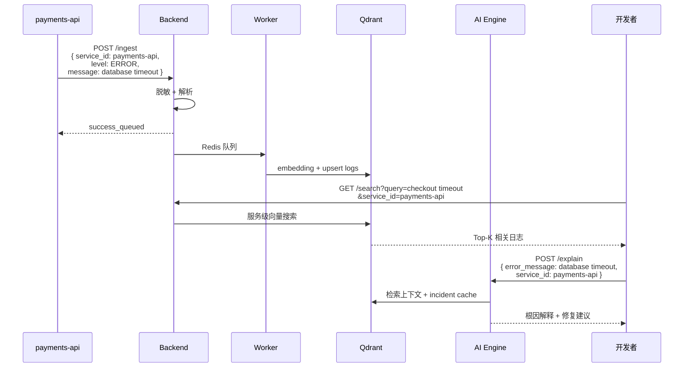

### 场景 B：重复错误降噪

同一 `"Connection refused to redis:6379"` 错误在 1 分钟内出现 500 次：

1. 第 1 条 → 新建 cluster，写入 `logs` + `log_clusters`
2. 第 2–500 条 → 相似度 ≥ 0.92，仅更新 cluster 的 `occurrence_count`
3. 搜索时用户看到 1 条代表日志 + cluster 元数据，而非 500 条重复向量

---

## 9. Alpha 阶段已知缺口

| 模块 | 状态 | 说明 |
|------|------|------|
| 异常检测 | ⚠️ 部分 | `analyze_log()` 已实现在 Worker 中导入但未调用 |
| Dashboard | ⚠️ 遗留 | 使用内存统计，非 Qdrant 实时数据 |
| Frontend × AI Engine | ⚠️ 未集成 | LogExplorer 未调用 `/explain` |
| Docker Compose | ⚠️ 不完整 | 不含 Backend / Worker / Frontend |
| 双搜索路径 | ℹ️ 设计如此 | GET（服务级）与 POST（全局+LLM）职责重叠，调用方需明确选择 |

---

## 10. 设计原则总结

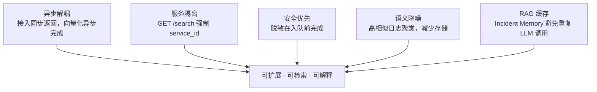

---

## 附录：文档索引

| 文档 | 路径 | 内容 |
|------|------|------|
| 项目 README | `README.md` | 能力概述、Quick Start、聚类配置 |
| 架构深度解析 | `docs/architecture_deep_dive.md` | 技术组件与数据流 |
| 服务级搜索规范 | `docs/service-scoped-vector-search.md` | service_id 摄入/存储/搜索 |
| 本文档 | `docs/business-logic.md` | 业务逻辑全景（本文） |

---

*最后更新：2026-07-02 · Logara AI Alpha*
